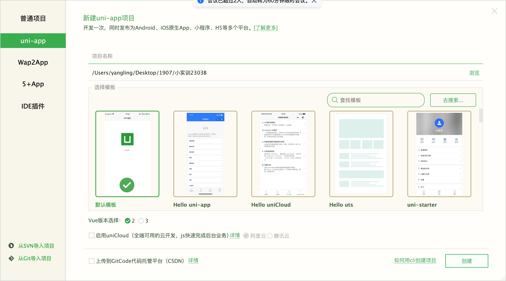
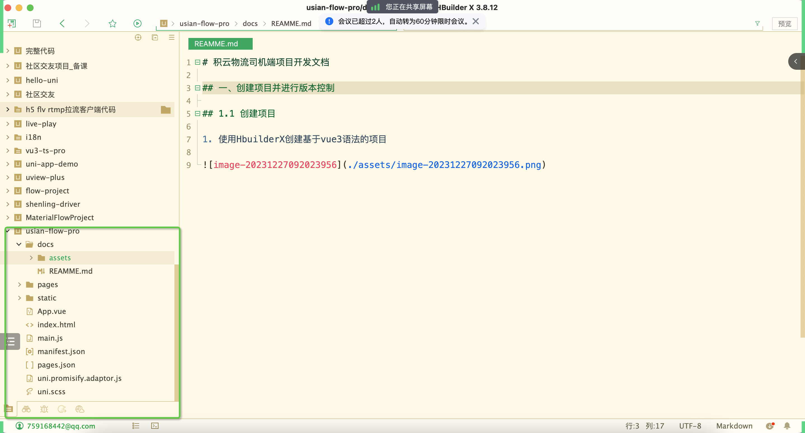

# 积云物流司机端项目开发文档

## 一、创建项目并进行版本控制

### 1.1 创建项目

1. 使用HbuilderX创建基于vue3语法的项目





### 1.2 使用Git对项目进行版本控制

1. 创建远程仓库
2. 初始化本地仓库
3. 将本地仓库与远程仓库建立连接
4. 将本地仓库推送到远程仓库


## 二、实现网络请求的封装

### 2.1 http请求的封装

1. 安装uni-fetch插件

```shell
npm install uni-app-fetch --save
```

2. 封装请求

`utils/uni-fetch.ts`

```typescript
// 导入createUniFetch请求方法
import { createUniFetch } from 'uni-app-fetch';

// 导入请求数据返回的数据类型
import { responseData } from './types/responseType';

// #ifdef VUE3
declare module 'vue' {
	interface ComponentCustomProperties {
		fetch: typeof uniFetch;
	}
}
// #endif

// 使用自定义选项创建实例
const uniFetch = createUniFetch<responseData>({
	loading: { title: 'loading...' },
	baseURL: 'https://slwl-api.itheima.net',
	intercept: {
		// 请求拦截器
		request(options) {
			// TODO 通过请求头发送token
			return options;
		},
		// 响应拦截器
		response(result) {
			// TODO token过期处理

			// TODO 无感知登录
			return result;
		}
	}
});

export default uniFetch;

```

3. 抽离返回的数据类型

`utils/types/responseType.ts`

```typescript
// 定义返回的数据类型
export interface responseData<T = any> {
	code: number
	msg: string
	data: T
}
```

### 2.2 api接口的封装

1.封装登录模块接口

`api/login.ts`

```typescript
/* 登录模块相关接口 */
import uniFetch from '../utils/uni-fetch'

// 导入登录模块所有接口参数类型
import { loginParamsType } from './types/loginType'

// 账号登录接口
export const login = (data: loginParamsType) => {
	return uniFetch({ url: '/driver/login/account', method: 'POST', data })
}

// 获取验证码接口
export const captcha = (data: string) => {
	return uniFetch({ url: '/driver/register/captcha', method: 'GET', data })
}

```

2. 定义登录模块所有参数类型

`api/types/loginType.ts`

```typescript
// 定义登录参数类型
export type loginParamsType = {
	/**
	 * 登录账号
	 */
	account: string;
	/**
	 * 登录密码
	 */
	password: string;
};

```

### 2.3 实现toast提示

`utils/utils.ts`

```typescript
import { utilsType, icon } from './types/utilsType'

const utils: utilsType = {
	/**
	 * 用户反馈（轻提示）
	 * @param {string} title 提示文字内容
	 * @param {string} icon 提示图标类型
	 */
	toast(title: string = '数据加载失败', icon: icon = 'none', mask: boolean = true) {
		uni.showToast({
			title,
			icon,
			mask
		})
	}
}
uni.utils = utils


```

`utils/types/utilsType.ts`

```typescript
// 定义icon类型
export type icon = 'none' | 'success' | 'error' | 'fail' | 'exception' | 'loading'

export type utilsType = {
	toast: (title: string, icon: icon, mask: boolean) => void
}

```

## 三、pinia的使用

### 3.1 安装pinia

```
npm install pinia --save
```

### 3.2 引入pinia

1. 在mian.js引入pinia
2. 初始化pinia
3. 将pinia注册到vue

`main.js`

```javascript
//1. 引入 Pinia
import { createPinia } from 'pinia'

// 2. 实例化Pinia
const pinia = createPinia()
	
// 3. 传递给项目应用
app.use(pinia)
```
